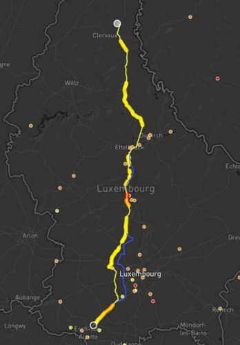

## Charge

Charge is a route planner for electric vehicles that uses a realistic consumption model based on driving speed and slope, and a realistic charging model to compute time optimal routes.
Charge uses C++17 and depends on `libosmium` for parsing OSM data in `.osm.pbf` format.
To easily compute and display routes Charge includes a HTTP server based on `web++.hpp`.
The web frontend is based on React and Mapbox GL JS.

## Build

You will need GCC 7 and above to compile `charge`:

```
mkdir build
cd build
cmake ..
make
```

## Data

### Charging stations

We accept charging stations as GeoJSON file with feasures of the following format:

```json
{
    "type": "Feature",
    "properties": {
        "rate": 120000.0
    },
    "geometry": {
        "type": "Point",
        "coordinates": [10.040342, 47.880344]
    }
}
```

Where rate needs to be the charging rate in watt.

### Elevation data

You can use `./scripts/srtm_download.py` to download SRTM elevation data tiles from OpenTopo and place them in `data/srtm`.

## Run

Prepare data and start the server using:

```
make run
```

### Frontend



To start the frontend you will need to have `npm` installed:

```
cd frontend
npm install
npm run start
```

